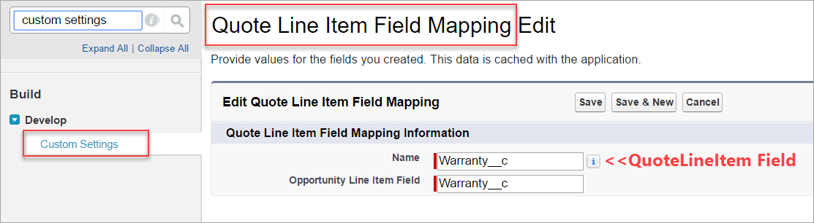
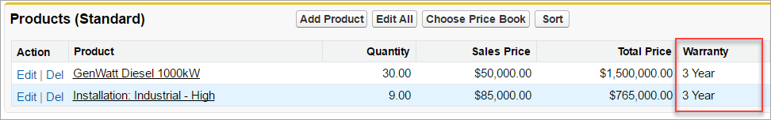
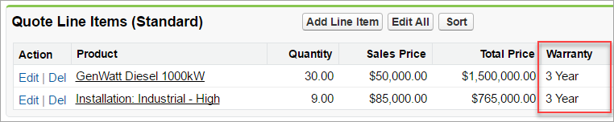

Copy OpportunityLineItem Custom Fields to New QuoteLineItems
============================================================

Overview
--------

At the time of this project, when a Quote is created or is syncing and you create an OpportunityLineItem then Salesforce automatically copies and syncs the OpportunityLineItem **standard** fields to the QuoteLineItem **standard** fields. **Custom** fields are ignored.

This project allows you to define via **custom setting** which OpportunityLineItem **custom** fields you want copied down to the newly created QuoteLineItem **custom** fields.

Please note that this project currently does not handle **syncing**. Please see FAQ below for more details.

Installation
------------

* [Deploy from GitHub](https://githubsfdeploy.herokuapp.com/)

Getting Started
---------------

1. Enable Quotes in your org. Navigate to `Setup | Customize | Quotes | Quotes Settings` and if you see the option to **Enable Quotes** then check the box and click `Save`.
2. Deploy code using link above. Since this is not a managed package you may need to edit the unit tests to pass any validation rules specific to your production org. For sandboxes and developer edition orgs then you should be able to deploy as-is.
3. Define field mappings in the custom setting. Navigate to `Setup | Develop | Custom Settings`, click on **Quote Line Item Field Mapping**, click on `Manage` button.
4. For each custom OpportunityLineItem field you want copied to a QuoteLineItem field then add a record to the custom setting. The `Name` field should be the **API Name of the QuoteLineItem Field** to copy into and the `Opportunity Line Item Field` should be, as you can imagine, the **API Name of the OpportunityLineItem Field** to copy from.
5. Go create an Opportunity, add some OpportunityLineItems (aka Products related list), then create a new Quote (you might need to add the Quotes related list to your Opportunity page layout). Note that the automatically created QuoteLineItems by Salesforce synced both the standard fields (default behavior) but also copied the configured custom fields (courtesy of this code).

Support, Issues, Questions
--------------------------

If you run into any deployment issues, have questions, have feedback for improvement, please post feedback as [issues](https://github.com/DouglasCAyers/sfdc-copy-opportunity-line-item-custom-fields-to-quote-line-items/issues) to this GitHub project. Make sure to review any closed issues as your question might have been already answered. Thanks!

FAQ
===

Does this project sync custom field values between OpportunityLineItems and QuoteLineItems?
-------------------------------------------------------------------------------------------

No. Once the QuoteLineItem record is created then this project does not handle syncing its field values up to the OpportunityLineItem or vice versa when either the OpportunityLineItem or QuoteLineItem are updated. The reason why is because that is a really hard problem to get right and not cause data corruption because Salesforce simply does not give us any reliable cross-reference from QuoteLineItem to OpportunityLineItem if the QuoteLineItem were to be created **first**.

Why this project is able to do what it does is because when a QuoteLineItem is automatically created by Salesforce when either (a) a new Quote is created or (b) when a new OpportunityLineItem is created and there is a syncing Quote then we get access to in a Workflow Rule Field Update the `OpportunityLineItem.Id` value (undocumented). So in that scenario we get a copy of the ID and store it on the QuoteLineItem. This allows us to cross-reference back to the OpportunityLineItem and copy down its field values to the QuoteLineItem. Technically, at this point, yes, we could support syncing but I don't yet because of the pain point in the next paragraph.

When a QuoteLineItem is created on a Quote manually by the user then there is no context of which OpportunityLineItem it belongs to. This can be confusing at times because if the Quote is syncing then Salesforce does automatically create an OpportunityLineItem and somehow magically knows which QuoteLineItem it came from and can minimally sync the Quantity and UnitPrice between the two records. However, we are not privy to how Salesforce is performing that cross-reference and so cannot use it in our own custom logic.

If I were to support syncing of custom OpportunityLineItem and QuoteLineItem fields then it would only be able to do so if the `Quote.Opportunity_Line_Item_ID__c` field were populated. Generally, your users would not see this field to know whether it was populated or not. And if your users ever decided to create a QuoteLineItem manually at the Quote level rather than firstly as an OpportunityLineItem and letting Salesforce automatically create the QuoteLineItem then when the users began to see custom fields being synced for SOME but not ALL records then they will begin asking you the admin questions and challenging the validity of this solution. You in turn might question the validity of this solution and log bugs. Then I would have to tell you that the scenario you're describing just isn't supportable and we're right back to where we began.

If data corruption is a risk you are willing to accept then you might consider this [Salesforce Labs app](https://appexchange.salesforce.com/listingDetail?listingId=a0N30000003Iop5EAC). It touts that it provides syncing but it does so based on trying to match QuoteLineItems and OpportunityLineItems together based on unique combination of field values on the record. However, if two or more QuoteLineItems and/or OpportunityLineItems have the same field values (e.g. price, quantity, product) then it is possible an incorrect record could be matched and updated. If you think that is an extremely low probability for you, give the app a whirl. I'm not that risky.

References
----------

* http://salesforce.stackexchange.com/questions/9292/access-to-the-related-quotelineitem-in-opportunitylineitem-trigger
* http://salesforce.stackexchange.com/questions/47343/does-quote-line-item-reference-back-to-which-oli-it-relates-to#comment73055_47550
* https://success.salesforce.com/ideaView?id=08730000000HpBH

